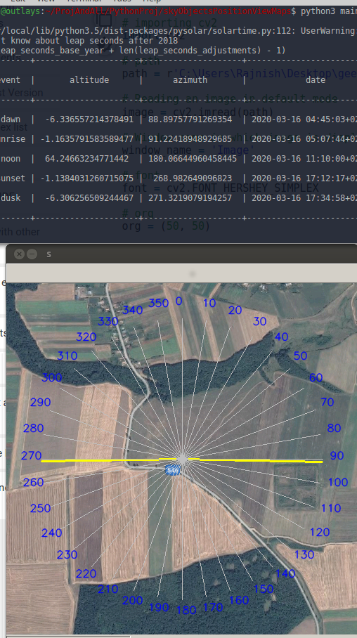

# Sun Position on Map

Generally, when someone wants to know something, the first thought is to google it. In my case, I wanted to get the exact position of Sunrise and Sunset at a given place on a given day and visualize it on the map. But my first thought was not to search but to write a script to solve this problem, more exciting to find the answer in this way. 

\
